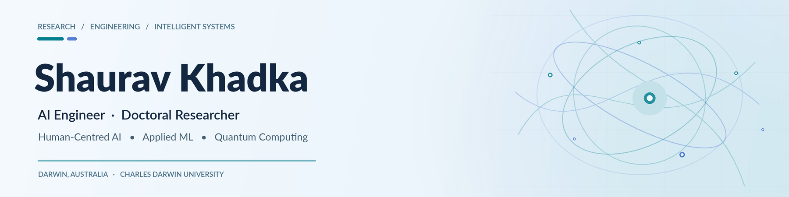

  <picture>
    <source media="(prefers-color-scheme: dark)" srcset="assets/banner-dark.png">
    <source media="(prefers-color-scheme: light)" srcset="assets/banner-light.png">
    
  </picture>

  

    
    
    
  

  
<strong>Building intelligent systems that are useful, understandable, and accountable to people.</strong>

---

## 🧠 About Me

I'm an **AI engineer and doctoral researcher at Charles Darwin University**, based in Darwin, Australia. My work sits at the intersection of **human-centred AI, intelligent systems, and applied machine learning**.

I'm interested in a question that goes beyond simply keeping a human “in the loop”: **when AI supports a decision, does the person still have the information, authority, and opportunity to exercise meaningful judgment?**

Alongside this research direction, I build and explore systems across natural language processing, quantum machine learning, computer vision, and robotics.

<table>
  <tr>
    <td width="50%" valign="top">
      <h3>🔬 Research</h3>
      
Human–AI decision-making, meaningful oversight, decision boundaries, explainability, and responsible AI in real-world workflows.

    </td>
    <td width="50%" valign="top">
      <h3>⚙️ Engineering</h3>
      
Applied NLP, retrieval and semantic search, deep learning, hybrid quantum–classical models, and intelligent applications.

    </td>
  </tr>
</table>

## 🚀 Featured Projects

<!-- Project descriptions are intentionally specific to the available repository documentation. -->
<table>
  <tr>
    <td width="50%" valign="top">
      <h3><a href="https://github.com/shauravkhadka/RedditPulse">📊 RedditPulse</a></h3>
      
<strong>Social Media Intelligence · NLP · Retrieval</strong>

      
A Streamlit dashboard for analysing Reddit discussions through sentiment classification, topic discovery, semantic search, and optional AI-assisted summarisation.

      

        
        
        
      

      
<a href="https://github.com/shauravkhadka/RedditPulse"><strong>Source code ↗</strong></a> · <a href="https://redditpulse.streamlit.app">Live demo ↗</a>

    </td>
    <td width="50%" valign="top">
      <h3><a href="https://github.com/shauravkhadka/Hybrid-Quantum-Classical-Image-Classifier-">⚛️ Hybrid Quantum–Classical Classifier</a></h3>
      
<strong>Quantum ML · Computer Vision</strong>

      
An image-classification experiment combining classical feature extraction with a PennyLane variational quantum circuit, including classical-baseline comparisons.

      

        
        
        
      

      
<a href="https://github.com/shauravkhadka/Hybrid-Quantum-Classical-Image-Classifier-"><strong>Explore project ↗</strong></a>

    </td>
  </tr>
  <tr>
    <td width="50%" valign="top">
      <h3><a href="https://github.com/shauravkhadka/Pasta-Detection-Robot-">🤖 Pasta Detection Robot</a></h3>
      
<strong>Robotics · Computer Vision</strong>

      
A ROS 2-based object-detection project exploring automated pasta recognition and classification in a robotics workflow.

      

        
        
        
      

      
<a href="https://github.com/shauravkhadka/Pasta-Detection-Robot-"><strong>Explore project ↗</strong></a>

    </td>
    <td width="50%" valign="top">
      <h3><a href="https://github.com/shauravkhadka/nepali-nlp-resources">🌏 Nepali NLP Resources</a></h3>
      
<strong>Low-Resource Languages · Open Resources</strong>

      
A curated index of Nepali-language datasets, speech resources, corpora, pretrained embeddings, and NLP tools for researchers and developers.

      

        
        
        
      

      
<a href="https://github.com/shauravkhadka/nepali-nlp-resources"><strong>Explore resources ↗</strong></a>

    </td>
  </tr>
</table>

  
<strong>More experiments and repositories</strong>

  

    <a href="https://github.com/shauravkhadka/qnl_nonmarkov_ml">Non-Markovian trajectory modelling</a> ·
    <a href="https://github.com/shauravkhadka/ML-Quantum-Computing">Quantum ML circuit demos</a> ·
    <a href="https://github.com/shauravkhadka/Adncanved-NLP-Reddit">Reddit NLP notebooks</a> ·
    <a href="https://github.com/shauravkhadka?tab=repositories">All repositories ↗</a>
  

## 🛠️ Technical Stack

**Machine learning & data**

  
  
  
  
  
  

**NLP & applications**

  
  
  
  

**Quantum, robotics & development**

  
  
  
  
  

## 📊 GitHub Insights

  <picture>
    <source media="(prefers-color-scheme: dark)" srcset="https://github-readme-stats.vercel.app/api?username=shauravkhadka&amp;show_icons=true&amp;theme=github_dark&amp;hide_border=true&amp;include_all_commits=true">
    <source media="(prefers-color-scheme: light)" srcset="https://github-readme-stats.vercel.app/api?username=shauravkhadka&amp;show_icons=true&amp;theme=default&amp;hide_border=true&amp;include_all_commits=true">
    
  </picture>
  <picture>
    <source media="(prefers-color-scheme: dark)" srcset="https://github-readme-stats.vercel.app/api/top-langs/?username=shauravkhadka&amp;layout=compact&amp;langs_count=6&amp;theme=github_dark&amp;hide_border=true">
    <source media="(prefers-color-scheme: light)" srcset="https://github-readme-stats.vercel.app/api/top-langs/?username=shauravkhadka&amp;layout=compact&amp;langs_count=6&amp;theme=default&amp;hide_border=true">
    
  </picture>

### Contribution Activity

  <picture>
    <source media="(prefers-color-scheme: dark)" srcset="https://github-readme-activity-graph.vercel.app/graph?username=shauravkhadka&amp;theme=react-dark&amp;area=true&amp;hide_border=true">
    <source media="(prefers-color-scheme: light)" srcset="https://github-readme-activity-graph.vercel.app/graph?username=shauravkhadka&amp;theme=github-compact&amp;area=true&amp;hide_border=true">
    
  </picture>

  
<strong>🏆 GitHub achievements</strong>

  

    <picture>
      <source media="(prefers-color-scheme: dark)" srcset="https://github-profile-trophy.vercel.app/?username=shauravkhadka&amp;theme=dark_dimmed&amp;no-frame=true&amp;no-bg=true&amp;column=6&amp;margin-w=5">
      <source media="(prefers-color-scheme: light)" srcset="https://github-profile-trophy.vercel.app/?username=shauravkhadka&amp;theme=flat&amp;no-frame=true&amp;no-bg=true&amp;column=6&amp;margin-w=5">
      
    </picture>
  

---

  <h3>Let's connect</h3>
  
Interested in human-centred AI, intelligent systems, applied machine learning, or research collaboration?

  
<a href="https://www.shauravkhadka.com.np"><strong>Portfolio & research</strong></a> · <a href="https://www.linkedin.com/in/shauravkhadka/"><strong>LinkedIn</strong></a> · <a href="https://github.com/shauravkhadka?tab=repositories"><strong>More code</strong></a>

  Research-led. Engineering-minded. Human-centred.

